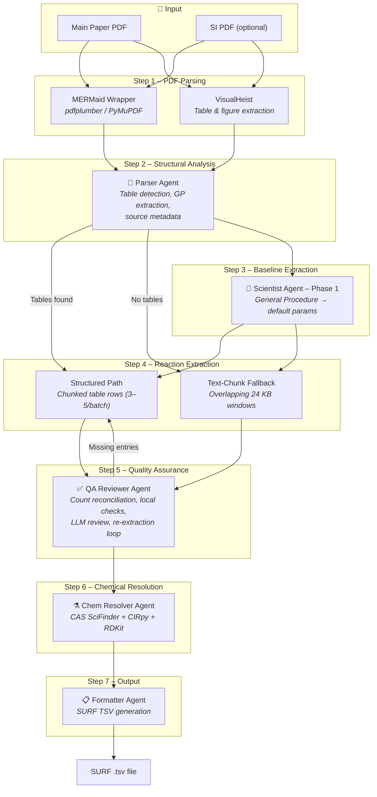

# SURF Extractor: Multi-Agent Chemical Reaction Data Extraction

[](https://opensource.org/licenses/MIT)
[](https://www.python.org/downloads/)
[](https://github.com/psf/black)
[](https://www.rdkit.org/)

## Summary
The extraction of standardized chemical reaction data from unstructured scientific literature remains a critical bottleneck in data-driven chemistry. **SURF Extractor** is an autonomous multi-agent pipeline powered by LLMs that extracts, validates, and normalizes reaction data from main publications and SI into the rigorous SURF format. Relying on an orchestrated team of agents, including an Extraction Agent, a Scientist, an Hallucination Critic, and a Chemical Resolution Agent this framework bridges NLP vision models and established cheminformatics tools to generate high-fidelity, machine-readable datasets for automated synthesis planning.

## Architecture

SURF Extractor implements a **multi-agent pipeline** where five specialized agents, orchestrated by a central Coordinator, progressively transform raw scientific PDFs into validated, machine-readable SURF records. The system exposes a **FastAPI** REST backend with asynchronous job processing and a static single-page frontend for interactive use.

### Pipeline Overview



### Agent Descriptions

| Agent | Module | Role |
|---|---|---|
| **Coordinator** | `agents/coordinator.py` | Top-level orchestrator. Manages the 7-step pipeline, decides between the structured and text-chunk fallback paths, and drives the QA re-extraction loop. |
| **Parser Agent** | `agents/parser_agent.py` | Structural PDF understanding via PyMuPDF `find_tables()`. Detects reaction tables using keyword heuristics, extracts General Procedure sections from SI text, and resolves source metadata (DOI, author, year). |
| **Scientist Agent** | `agents/scientist_agent.py` | Chemical domain expert powered by Gemini 2.5 Pro. Operates in two phases: (1) reads General Procedures to establish baseline default parameters, (2) processes small batches of table rows, inheriting baseline values and overriding only what each entry specifies. Enforces strict JSON output and unit conversions (mol% → eq, min → h). |
| **QA Reviewer Agent** | `agents/qa_reviewer_agent.py` | Count-aware validator. Reconciles extracted row counts against parser expectations, identifies missing entries by `rxn_id`, runs local checks (CAS format, yield-type vocabulary, numeric fields), and optionally invokes an LLM review pass for semantic correction. |
| **Chem Resolver Agent** | `agents/chem_resolver_agent.py` | Resolves `PENDING_CONVERSION` CAS numbers and SMILES strings using a multi-strategy cascade: CAS SciFinder API → CIRpy/NCI resolver → RDKit canonicalization. Runs concurrently via a thread pool. |
| **Formatter Agent** | `agents/formatter_agent.py` | Deterministic serializer. Compiles resolved SURF rows into a tab-separated file following the canonical SURF column order (60+ fields), with dynamic discovery of extra compound columns. |

### Integration Layer

| Integration | Module | Purpose |
|---|---|---|
| **MERMaid Wrapper** | `integrations/mermaid_wrapper.py` | Text extraction (pdfplumber → PyMuPDF fallback) + optional VisualHeist ML-based image extraction for tables rendered as figures. |
| **ChemConverter Wrapper** | `integrations/chemconv_wrapper.py` | Chemical name → CAS/SMILES resolution via vendored `CASClient` and `CIRpy`. Thread-safe singleton pattern. |
| **PortKey Client** | `portkey_client.py` | Synchronous LLM gateway client. Calls Gemini 2.5 Pro via the Galileo/PortKey API with automatic RCN → WAF endpoint failover. Supports multimodal (text + image) messages. |


### Project Structure

```
surf_extractor/
├── src/surf_extractor/          # Main Python package
│   ├── main.py                  # FastAPI application (4 endpoints)
│   ├── models.py                # Pydantic models (SURFRow, ParsedDocument, QAResult, …)
│   ├── portkey_client.py        # PortKey/Galileo LLM gateway client
│   ├── agents/                  # Multi-agent system
│   │   ├── base_agent.py        # BaseAgent with LLM chat methods
│   │   ├── coordinator.py       # Pipeline orchestrator
│   │   ├── parser_agent.py      # Structural PDF analysis
│   │   ├── scientist_agent.py   # Chemical data extraction (Gemini 2.5 Pro)
│   │   ├── qa_reviewer_agent.py # Validation & re-extraction loop
│   │   ├── chem_resolver_agent.py # CAS/SMILES resolution
│   │   └── formatter_agent.py   # SURF TSV serialization
│   ├── integrations/            # External tool wrappers
│   │   ├── mermaid_wrapper.py   # PDF text + image extraction
│   │   └── chemconv_wrapper.py  # Chemical name resolution
│   └── vendor/                  # Vendored third-party code
│       ├── cas_client.py        # CAS SciFinder API client
│       ├── converters.py        # IUPAC → SMILES conversion
│       └── visualheist/         # ML-based figure/table extraction
├── frontend/                    # Single-page web UI (index.html)
├── tests/                       # Test suite
├── notebooks/                   # Jupyter notebooks for demos
├── data/                        # Input data directory
├── outputs/                     # Generated SURF TSV files
├── run.sh                       # Startup script (uv / pip + uvicorn)
├── pyproject.toml               # Build configuration (hatchling)
├── requirements.txt             # Full dependency list
└── environment.yml              # Conda environment specification
```

## Installation 

We recommend using `conda` to ensure a clean cheminformatics environment:

```bash
git clone https://github.com/YourOrg/surf_extractor.git
cd surf_extractor

conda env create -f environment.yml
conda activate surf_extractor

pip install -e .
```

## Quick Start
Run the primary backend server:
```bash
./run.sh
```

Or programmatically access via agents:
```python
from surf_extractor.agents.coordinator import CoordinatorAgent
from surf_extractor.integrations.mermaid_wrapper import PDFParser

# Initialize coordination
coordinator = CoordinatorAgent()
# ... 
```
